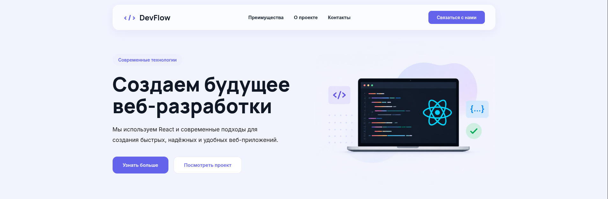

<div align="center">

# DevFlow

### Modern React Landing Page

Адаптивный лендинг, разработанный на React с использованием современных подходов к фронтенд-разработке.

<br>


</div>

---

## About

**DevFlow** — современный адаптивный лендинг, созданный в рамках производственной практики для изучения возможностей React и современных инструментов фронтенд-разработки.

Проект демонстрирует:

- компонентный подход React;
- адаптивную верстку;
- современный SaaS-дизайн;
- организацию структуры проекта;
- практическое применение Vite.

---

## Preview



---

## Features

- Современный SaaS-интерфейс
- Полностью адаптивный дизайн
- React Hooks
- React Hook Form + Zod
- Lenis Smooth Scroll
- React Modal
- Cookie Consent Banner
- Политика конфиденциальности
- Компонентная архитектура
- Оптимизированная структура проекта

---

## Tech Stack

| Technology | Description |
|------------|------------|
| React | Построение пользовательского интерфейса |
| Vite | Сборка и запуск проекта |
| JavaScript | Логика приложения |
| CSS3 | Стилизация интерфейса |
| Git | Контроль версий |
| GitHub | Хранение репозитория |

---

## Project Structure

```text
src
├── assets
│   ├── images
│   │   ├── about.png
│   │   └── hero-laptop.png
│   ├── hero.png
│   └── vite.svg
│
├── components
│   ├── About.jsx
│   ├── Contacts.jsx
│   ├── CookieBanner.jsx
│   ├── Features.jsx
│   ├── Footer.jsx
│   ├── Header.jsx
│   ├── Hero.jsx
│   ├── Modal.jsx
│   ├── PrivacyModal.jsx
│   └── ScrollToTop.jsx
│
├── hooks
│   └── useScrollTo.js
│
├── lib
│   └── lenis.js
│
├── schemas
│   └── contactSchema.js
│
├── styles
│   ├── components
│   │   ├── about.css
│   │   ├── contacts.css
│   │   ├── cookie-banner.css
│   │   ├── features.css
│   │   ├── footer.css
│   │   ├── header.css
│   │   ├── hero.css
│   │   └── modal.css
│   │
│   ├── global.css
│   └── styles.css
│
├── utils
│   └── contactService.js
│
├── App.jsx
└── main.jsx
```

---

## Installation

### Clone repository

```bash
git clone https://github.com/robot122-dev/devflow.git
cd devflow
```

### Install dependencies

```bash
npm install
```

### Start development server

```bash
npm run dev
```

### Build project

```bash
npm run build
```

---

## Goals

- [x] Инициализация проекта
- [x] Разработка интерфейса
- [x] Создание компонентов
- [x] Адаптивная верстка
- [x] Валидация формы
- [x] Плавный скролл
- [x] Cookie Banner
- [x] Модальные окна
- [x] Финальная сборка

---

## Author

**Бычков В.А.**

Производственная практика · 2026

---

<div align="center">

Made with React & Vite

</div>